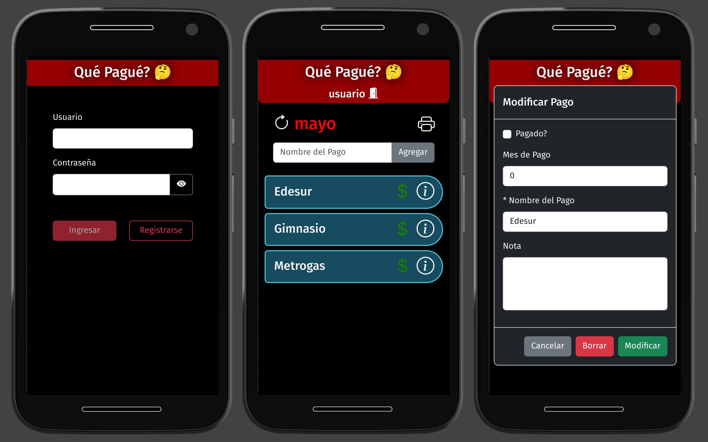

# QUEPAGUE APP
  

**quePague** es una SPA para gestionar gastos fijos mensuales.  
**quePague** consta de dos pantallas, una para loguearse y un dashboard para realizar toda la gestión de los pagos.  
En esta última pantalla se pueden:
1. Agregar pagos.
2. Marcarlos como pagados (click boton $).
3. Editar el nombre del pago y/o la fecha en el que se realizó (click boton edicion).
4. Marcar pago como "anual" indicando el mes de pago para que este habilitado.
5. Agregar notas.
6. Borrado del pago (click boton borrar).
7. Generacion de archivo pdf con el estado de los pagos agendados.

La idea de la app es que los gastos permanezcan cada mes para realizar un seguimiento de los mismos, pudiendo también en cada comienzo de mes poder resetear, de forma general, la condicion de cada pago a cero.

La aplicación la realicé para uso personal al mismo tiempo que fué una excusa para seguir aprendiendo distintas tecnologías.

  🧰 🛠️ quePagué (Backend) fue desarrollado con:
- Intellij IDEA
- Springboot 3.0.6
- Spring Validation
- Lombok
- Spring Security 6.0.2
- JWT (Json Web Token)
- JPA/Hibernate
- MySQL
 
 🧰 🛠️ quePagué (Frontend) fue desarrollado con:
- Visual studio code
- Angular 14
- Bootstrap 5

Para tener este proyecto en tu 💻, simplemente tenés que clonarlo (o bajarlo en formato .zip) y listo!! 😊